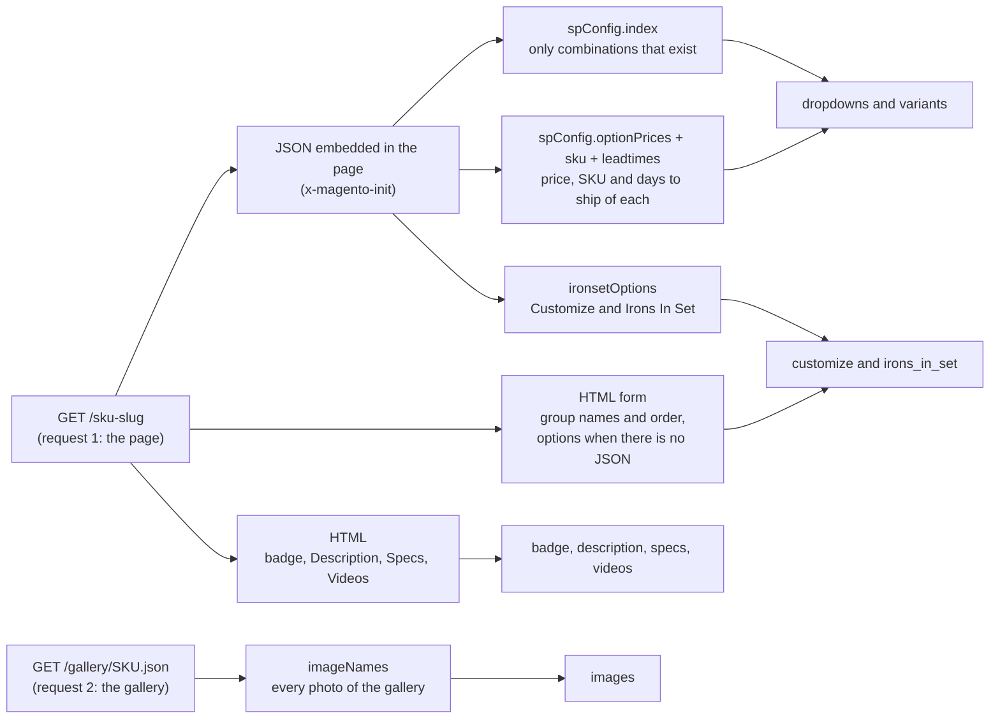
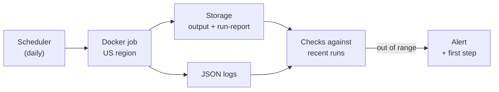
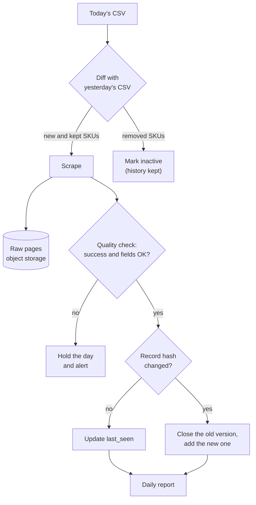

# retail-acquisition-engine — Design

How the scraper works, and why. Each section starts with **the question** it
answers and **a short answer**; details, tables and diagrams follow. For setup
and commands, see the [README](README.md).

## Questions at a glance

| Question                                                        | Short answer                                                           | Where |
| --------------------------------------------------------------- | ---------------------------------------------------------------------- | ----- |
| How does it get the data, only for the products in the CSV, while staying **considerate of the site**? | Plain HTTP requests that read the JSON each page embeds; URLs built from the CSV's SKUs; polite pace by default | [1. Approach](#1-approach) |
| What is captured for each product (**details, customization options, media**), and how is it **modeled**? | 696 of 700 products, each one record named like the product page     | [2. Data model](#2-data-model) |
| How are **options that depend on earlier choices** found, with their **valid configurations** and **price changes**? | The page lists the 280,886 combinations that exist, each with its price; Customize adds fixed prices | [3. Conditional options](#3-conditional-options-and-price-changes) |
| How **accurate** is the data?                                    | The store's own data, validated, and checked twice with 0 differences  | [4. Accuracy](#4-accuracy) |
| How **fast** is it, how was it **measured**, and what could be **faster**? | 1 min 57 s for 700 products, measured per product and per run          | [5. Runtime](#5-runtime) |
| What **could not be captured** reliably?                         | 4 products the site does not sell; reviews, stock counts and a few rules not in the page's data | [6. Not captured](#6-data-that-could-not-be-captured-reliably) |
| How would it **run, be monitored and maintained** in production? | A scheduled Docker job in a US region, watched through its exit code, logs and run report | [7. Production](#7-production-run-monitor-maintain) |
| How would a **daily CSV** be handled: new products, price changes, history, alerts? | Diff the CSV, keep the raw pages, check quality, store only changes (SCD Type 2), report daily | [8. Daily CSV](#8-daily-csv-pipeline) |
| How do I **run it**, and where is the **output**?                | `make install` and `make dev`; `output.json` and two CSVs              | [README](README.md#quick-start) |

## 1. Approach

> **Question:** how does it get each product's data, only for the products in
> the CSV, while staying considerate of the site?

**Answer**

- **Plain HTTP + the JSON each page embeds.** The store (Magento 2) builds its product page from JSON inside the page: variants, prices and Customize options. The scraper reads that JSON, so it needs no browser and no clicking: 2 small requests per product (the page and its gallery).
- **Only the CSV's products.** Each URL is built from the CSV's SKU (`LINK 2.2 PUT` → `/link-2dot2-put`), and the page's own SKU must match it.
- **Considerate of the site.** By default 4 requests at a time and one new product every 500 ms. Retries wait longer each time, the run stops after 3 blocks in a row, and it resumes later without asking twice for what it already has.

| | Clicking through the page in a browser | Reading the page's JSON (this scraper) |
| ------------------------- | -------------------------------------- | -------------------------------------- |
| Requests per product      | The page, its scripts and images, then one update per click | 2: the page and its gallery JSON |
| Combinations found        | Only those clicked                     | All that exist, from the page's own list |
| Load on the site          | High                                   | Low                                    |

## 2. Data model

> **Question:** what is captured for each product (details, customization
> options, media), and how is it modeled?

**Answer**

- **What is captured:** details (name, badge, description, specs), the variant dropdowns and every valid combination, the Customize options with their prices, the Irons In Set clubs, and media (the photo gallery and the YouTube videos).
- **How it is stored:** one record per product in `output.json`; `variants.csv` and `customizations.csv` flatten it for spreadsheets.
- **How fields are named:** after what a shopper sees on the product page, in the same order.

| Captured in the last run            | Count |
| ----------------------------------- | ----- |
| Products                            | 696 of 700 (the other 4 in [section 6](#6-data-that-could-not-be-captured-reliably)) |
| Valid combinations (variants)       | 280,886, each with SKU, price and days to ship |
| Customize options                   | 38,983, each with its price |
| Descriptions · specs tables         | 696 · 689 |
| Images · videos                     | 3,397 (every gallery) · 852 on 535 products |
| Badges ("PRE ORDER", "NEW ITEM")    | 21 |

### The record at a glance

Each field with its type, what it is on the product page, and an example.
`[]` marks a list and `?` a field that can be `null`.

```text
Product                          one record per product in output.json
├─ sku              string       site SKU, the CSV's "Parent Item"      "PRO S4 STS"
├─ name             string       the page title                         "Mizuno Pro S-4 Iron Set"
├─ brand, category, model        from the CSV                           "Mizuno", "Iron Set", "Pro S-4"
├─ url              string       the product page
├─ badge            string?      the ribbon over the photos             "NEW ITEM", "PRE ORDER"
├─ starting_at      number       "Starting At"                          215
├─ per_club         boolean      "Per Club": iron sets                  true
├─ dropdowns[]                   the dropdowns that pick the variant
│  ├─ label         string                                              "Dexterity"
│  └─ options[]     string                                              "Right Handed", "Left Handed"
├─ irons_in_set?                 the "Irons In Set" checkboxes
│  ├─ options[]     string                                              "3 Iron" … "PW"
│  └─ checked[]     string       checked by default                     "4 Iron" … "PW"
├─ customize                     the "Customize" section
│  ├─ required      boolean      every dropdown must be chosen          false
│  └─ dropdowns[]
│     ├─ label      string                                              "Ferrule"
│     └─ options[]
│        ├─ name    string                                              "ICON (Black/Blue/White)"
│        └─ price   number       "+ $2.50", on top of the variant       2.5
├─ variants[]                    every combination the store sells
│  ├─ sku           string       the SKU in the cart                    "C4605039"
│  ├─ selected      object       dropdown label → option chosen         {"Dexterity": "Left Handed", …}
│  ├─ product_price number       "Product Price"                        275
│  └─ ships_in_days number?      days to ship, 1 = in stock             21
├─ images[]         string       the photo gallery (URLs)
├─ videos[]         string       the Videos tab (YouTube URLs)
├─ description      string       the Description tab, a line per paragraph
├─ specs[]          object       the Specs tab, a row per entry         {"Club": "3", "Loft": "21°", …}
└─ scraped_at, extraction_time_ms   when it was scraped, and how long it took
```

`variants.csv` has one row per variant and `customizations.csv` one row per
Customize option, both with the product's SKU and name.

### Required Customize

- **Normal products:** the Customize dropdowns appear only after clicking "Customize", and they are optional.
- **57 products** (45 driver shafts, 8 hybrid shafts, 4 L.A.B. Golf putters): the page always shows them, the Standard | Customize switch is faded, and **every one must be chosen** ("This is a required field."). In the output, `customize.required` is `true`.
- **How many:** the 53 shafts have 4 (length, grip install, grip model and tip adapter); the putters have 5 (3 of them) or 7 (1).

### Shipping

- **`ships_in_days`** is each variant's time to ship, in days, from the page's lead times.
- **`1` means in stock** ("In stock • Ships in 1 business day"); the page shows longer times in weeks ("Typically ships in 3 Weeks").

### Full records

[`results/sample/output.json`](results/sample/output.json) has 5 complete
records, and the [full results](README.md#results) all 696.

## 3. Conditional options and price changes

> **Question:** some options appear or change with earlier choices. How are
> they found, and how are the valid configurations and their price changes
> represented?

**Answer**

- **Discovery:** the page embeds the list of combinations that exist (`spConfig.index`), and its dropdowns are built from it. That list *is* the conditional logic, so the scraper reads it instead of clicking.
- **Valid configurations:** 280,886 variants, each with the options it takes, its own SKU, price and days to ship. A combination that is not in the list is not sold, and is not in the output.
- **Price changes:** each variant has its own price; a Customize option adds a fixed amount; iron sets multiply both by the clubs checked.

### Where each part comes from



| Source                           | Gives                                                       |
| -------------------------------- | ----------------------------------------------------------- |
| `spConfig`                       | `dropdowns` (`attributes`); **only the combinations that exist** (`index`); the price, SKU and days to ship of each (`optionPrices`, `sku`, `leadtimes`) |
| `ironsetOptions`                 | Customize prices (`optionConfig`), Irons In Set (`option_type: "clubs"`) and its checked clubs, `forceRequireOptions` (`customize.required`) |
| HTML                             | The Customize labels and their order (no JSON has them), the Customize options on the 66 pages without the JSON, the badge, the Description / Specs / Videos tabs, the canonical `url` |
| `/gallery/<SKU>.json` (2nd request) | `images`: the page's gallery. The page's own JSON only has the main photo, used if a product has no gallery |

> [!TIP]
> **Example:** `OPUS SP BS WGS` has about 700,000 theoretical combinations
> (6 bounces × 5 grinds × 9 lofts × 2 materials × 2 hands × 8 flexes × 81 shafts).
> The page lists the **3,888** the store sells, and the output has exactly those.

### How the page uses that list

What a shopper sees while choosing. The explorer's **Clone** view replays the
page's own rules:

| On the page                                   | What happens                                                  |
| --------------------------------------------- | ------------------------------------------------------------- |
| Dropdowns open one at a time                  | The next one unlocks once the one above is chosen             |
| Options that are not sold do not appear       | Each dropdown lists only what some variant offers with the choices above |
| A dropdown left with one option               | The page chooses it for you (the first dropdown, on 285 products) |
| Club Length, Shaft Model, Subcategory, Club Color | Sorted A to Z                                             |
| Shaft Model                                   | Split into STANDARD SHAFTS and CUSTOM SHAFTS (dearer than the starting price) |

### Price changes

| What changes the price | On the page                  | In the output                       | Example (PRO S4 STS)                  |
| ---------------------- | ---------------------------- | ----------------------------------- | ------------------------------------- |
| The variant chosen     | "Product Price"              | `variants[].product_price`          | From $215.00 to $275.00; the Aerotech SteelFiber i110 shaft is $275.00, +$60.00 over the start |
| A Customize option     | "+ $2.50" next to the option | `customize.dropdowns[].options[].price` | ICON ferrule: + $2.50              |
| The clubs of an iron set | "Per Club"                 | `per_club`, `irons_in_set.checked`  | ($275.00 + $2.50) × 7 clubs = $1,942.50 |

### Why configurations are not listed one by one

- **Variants are what the store sells as SKUs**, and all of them are in the output.
- **Every Customize choice and every set of clubs on top** would make about **1.4 × 10¹³** configurations.
- **So the output keeps the pieces** (variants, Customize prices, clubs), and any configuration's price follows from them, as in [Price changes](#price-changes).

### Rules between Customize options

Customize options do not depend on the variant, and their prices are fixed.
A few rules between them live only in the page's JavaScript:

| Rule                                                        | Applies to                   | In the output |
| ----------------------------------------------------------- | ---------------------------- | ------------- |
| Every Customize dropdown is required (`forceRequireOptions`) | 57 products                 | `customize.required` |
| Choosing a length or one grip field makes the grip model and grip install required | 9 products, found by their labels | No; the Clone and Alternative views apply it |
| An upgrade shaft makes the tip and the length required      | No product in this CSV       | — |

## 4. Accuracy

> **Question:** how accurate is the data, and how is that checked?

**Answer**

- **The store's own data:** the scraper reads the same JSON the page's script uses, not the text a browser shows.
- **Strict:** every JSON block is validated, a combination is kept only if it is complete, and the page's SKU must match the CSV.
- **Checked twice, 0 differences:** against an independent re-parse of the saved pages, and against the page's own dropdown script.

| Check                         | How                                                                  |
| ----------------------------- | -------------------------------------------------------------------- |
| **Validated**                 | Every JSON block is checked with zod; a changed field fails the product with `site data changed in …` |
| **Complete combinations**     | A combination needs a price and an option for every dropdown         |
| **Right page**                | The page's SKU must match the CSV's `Parent Item`                    |
| **Counted**                   | `run-report.json` counts the products that have each part (`coverage`), so an empty field shows up as a drop |
| **Independent re-parse**      | On the 696 pages saved on 2026-10-07, the parser matched a separate Python script with 0 differences |
| **The page's own script**     | Its dropdown script (`configurable-option-mixin.js`), replayed on the saved pages, listed the same options as the Clone view at every step on 663 products (18,955 dropdowns). The other 33 changed price between the saved pages (2026-10-07) and the run (2026-10-08) |
| **Failures explained**        | Each failed product is listed with its reason; the run exits with code 1 if more than 10% fail |

## 5. Runtime

> **Question:** how fast is it, what are the trade-offs, how was it measured,
> and where could it be faster?

**Answer**

- **Result:** 1 min 57 s for the 700 products with 20 requests in parallel; 47 s when the site's cache is warm; about 8 min with the polite defaults.
- **Measured** with `performance.now()`, per product and per run; `run-report.json` keeps it.
- **Biggest trade-off:** polite defaults, about 4 times slower than the fastest run, to avoid blocks.

Full runs of the current code with `CONCURRENCY=20 DELAY_MS=0`: 1,396 requests
(page + gallery), 0 retries, 0 blocks. The site's page cache matters more than
any setting:

| Run (UTC)                                            | Time           | Per product (p50 · p95) |
| ---------------------------------------------------- | -------------- | ----------------------- |
| 2026-10-08 01:39, cache cold (the run in `results/`) | **1 min 57 s** | 2.8 s · 6.0 s           |
| 2026-10-07 22:56, cache warm after another run       | **47 s**       | 1.1 s · 2.5 s           |

### How it was measured

- **Per product:** `performance.now()` around each product (`extraction_time_ms` in the record).
- **Per run:** the total, products per minute, p50 / p95 / max and the pacing settings, all in `run-report.json`.

### Trade-offs

| Decision                         | Why                                               | Cost                                         |
| -------------------------------- | ------------------------------------------------- | -------------------------------------------- |
| HTTP + embedded JSON, no browser | One request has every configuration and price     | Depends on the JSON shape (zod catches changes) |
| URLs built from the SKU          | The site search is disallowed by `robots.txt` and answered 406 after about 40 searches | Relies on the URL convention (the SKU is checked on the page) |
| Conservative defaults (4 at a time, one new product every 500 ms) | No blocks: 87 products per minute, 8 min 3 s | About 4 times slower than the runs above |
| Backoff retries (5 s → 40 s), stop after 3 blocks | Survives throttling without hammering the site | A blocked run ends early and resumes later |

### Where to improve

- **More parallel requests without the pace:** 2 min instead of 8. Agree on a rate with the site first.
- **Stream `output.json` as JSON Lines:** about 110 MB is built in memory today.
- **Skip unchanged records** by content hash in daily runs.
- **Tried and dropped:** page and gallery at once (46 s against 47 s, with twice the requests in flight).
- **Slowest page:** `VZN1 I CUSTOM PUT` (11.9 MB) takes 20–25 s with the cache cold, hence the 60 s timeout.

## 6. Data that could not be captured reliably

> **Question:** what data could not be captured reliably, and why?

**Answer**

- **4 of 700 products** have no data, because the site does not sell them; each one has its reason in `run-report.json`.
- **A few things are not in the page's data** (reviews, stock counts) or live only in its JavaScript (rules between Customize options).
- **None of them blocks the main data**, and most could be added if needed (last column below).

| SKU                    | Reason                                                     |
| ---------------------- | ---------------------------------------------------------- |
| `2026 HL MAX D WGS`    | Out of stock: the site shows $0.00 and no configurations   |
| `2026 HL MAX D FWG`    | Out of stock: same as above                                |
| `KM2 PUT`              | No product page (404); the site search finds nothing       |
| `STAFF MOD TG NEW WGS` | Redirects to a generic model page with no product data     |

| Data                            | Why it is not captured                                         | If it were needed                          |
| ------------------------------- | -------------------------------------------------------------- | ------------------------------------------ |
| Rules between Customize options | Only in the page's JavaScript ([section 3](#rules-between-customize-options)); `customize.required` covers the 57 products where all are required | Write the rule into the output; the Clone view already applies it |
| Stock count                     | The page's JSON has none; `ships_in_days` = 1 marks the variants in stock | Not available on the page             |
| Media files                     | Kept as URLs, not downloaded; no per-configuration images exist | Download the 3,397 images to storage      |
| Add-ons                         | The "Add On" box (e.g. Tour B XS balls, $19.99) is a separate product | Scrape the add-ons as products of their own |
| Group headers in dropdowns      | "STANDARD / PREMIUM GRIPS" and "STANDARD / CUSTOM SHAFTS" are built by the page's script from the prices, which the output keeps | Derive them from the prices, as the Clone view does |
| Reviews                         | A third-party widget (Yotpo) loads them after the page opens   | Yotpo's own API, if its terms allow it     |
| Specs of 7 products             | 6 have no Specs tab; `20 AKA OM-5 NEW PUT` writes them as prose | Parse that one description by hand        |
| Labels                          | Kept as the site writes them, which varies ("Grip" / "Grips", "Length" / "LENGTH"); 24 products repeat an option, as the site does | Normalize them in a later step |

## 7. Production: run, monitor, maintain

> **Question:** how would it run, be monitored and be maintained in production?

**Answer**

- **Run** the Docker image as a daily scheduled job in a US region (the site only serves US IP addresses). Any cloud works; nothing ties it to one.
- **Monitor** what matters for data: products that passed validation, blocks, filled fields, duration and freshness. Alert when they move away from recent runs.
- **Maintain** with a first step for every alert, zod errors that name the changed field, and 37 offline tests in CI.



### Run it on any cloud

| Piece              | AWS                         | Google Cloud                  | A single server |
| ------------------ | --------------------------- | ----------------------------- | --------------- |
| Scheduler          | EventBridge Scheduler       | Cloud Scheduler               | cron            |
| Job (US region)    | ECS Fargate task            | Cloud Run Jobs                | `docker run`    |
| Output             | S3                          | Cloud Storage                 | A disk          |
| Logs and alerts    | CloudWatch Logs and Alarms  | Cloud Logging and Monitoring  | Grafana and Loki |

### What to watch, and what to do

The thresholds are starting points, to tune after a few weeks of runs.

| Signal              | Where                                   | Alert when                               | First step                                   |
| ------------------- | --------------------------------------- | ---------------------------------------- | -------------------------------------------- |
| **Run failed**      | Exit code 1                             | Any run                                  | Read the failures in `run-report.json`       |
| **Success rate**    | `run-report.json`: `ok` of `products`   | Under 90%, or 5 points under the week's average | Open a failed product in the explorer next to its live page |
| **Blocks**          | Logs: `retry`, `run_stopped`            | Any `run_stopped`                        | Check the job's region and IP; lower `CONCURRENCY` |
| **Site changed**    | Logs: `site data changed in …`          | Any                                      | Update that zod schema and the parser; add the page as a test |
| **Filled fields**   | `run-report.json`: `coverage`           | A field drops more than 2%               | Compare with the previous run; check that part of the page |
| **Duration**        | `run-report.json`: total and p95        | Twice the week's average                 | Look for retries in the logs: the site may be slow or throttling |
| **Freshness**       | Storage                                 | No new output for 26 h                   | The scheduler or the job did not run         |

### Maintain

- **Tests:** 37 offline tests run in CI on pages shaped like the site's; a page that breaks the parser becomes a new test.
- **Site changes:** zod names the exact field that changed; `STATE_VERSION` resets old resume state after the output format changes.
- **Checking by eye:** `make explorer` opens any product in three views (Explorer, Clone, Alternative) next to its live page.
- **Resume:** an interrupted run continues from `state/scraper.db`.

## 8. Daily CSV pipeline

> **Question:** with a new CSV every day, how would the workflow find new
> products, detect changes to variants and prices, keep their history, and
> flag changes or failures for review?

**Answer** (an outline, not implemented)

1. **Identify:** diff today's CSV with yesterday's: new, kept and removed SKUs.
2. **Scrape** every active SKU at a gentle pace, and **keep the raw pages**.
3. **Check quality** before trusting the day: success rate and filled fields within their usual range.
4. **Detect changes:** a hash per record; when it differs, compare variant by variant.
5. **Store history** as SCD Type 2: only changes add rows.
6. **Flag** changes and failures in a daily report.



### Three layers of data

| Layer       | What                                                                 | Why                                              |
| ----------- | -------------------------------------------------------------------- | ------------------------------------------------ |
| **Raw**     | Each day's page and gallery JSON per SKU, compressed, in object storage (e.g. 30 days) | Re-parse past days without scraping again when the parser changes |
| **Parsed**  | That day's `output.json` and `run-report.json`                       | The same files the scraper writes today          |
| **History** | PostgreSQL tables, one row per change (SCD Type 2)                   | Prices and variants over time, without ~280,000 near-identical rows a day |

### Each need, and how

| Need                                            | How                                                                    |
| ----------------------------------------------- | ---------------------------------------------------------------------- |
| **Identify and scrape new products**            | Diff today's CSV with yesterday's by `Parent Item`: new SKUs are scraped and inserted, removed ones marked inactive, never deleted. Every active SKU is scraped once a day at a gentle pace (e.g. `CONCURRENCY=1 DELAY_MS=10000`, about 2 h); the run state is keyed by date, so a re-run the same day resumes |
| **Detect changes to variants and prices**       | SHA-256 of each record without `scraped_at` and `extraction_time_ms`. Same hash: nothing to write. Different: compare by variant SKU and Customize option, and classify the change (price, shipping time, variant or option added / removed, out of stock, gone). Changes are frequent: in 13 h, 22,690 variant prices changed in 36 products |
| **Store their history**                         | SCD Type 2: a change closes the current row (`valid_to`) and inserts a new one, so any past day can be rebuilt. The raw pages allow re-parsing a day if the parser had a bug |
| **Flag changes for review**                     | A daily report (Slack or email). For review: prices that moved more than 10%, variants or options added or removed, products gone, and products the CSV still lists that the site does not sell (like the 4 of this run). Smaller moves appear in the report only |
| **Flag failures for review**                    | The day is held, not written to history, when the quality check fails; plus the alerts of [section 7](#what-to-watch-and-what-to-do). Out of stock and not found are status changes, not failures |

| Table                  | Columns                                                                     |
| ---------------------- | --------------------------------------------------------------------------- |
| `products`             | `sku` PK, name, brand, category, active, first_seen, last_seen              |
| `product_versions`     | sku, content_hash, data JSONB, valid_from, valid_to, is_current             |
| `variant_prices`       | sku, product_sku, selected JSONB, product_price, ships_in_days, valid_from, valid_to, is_current |
| `customize_prices`     | product_sku, dropdown, option, price, required, valid_from, valid_to, is_current |
| `runs`                 | run_id, started_at, finished_at, ok, failed, requests, status               |
