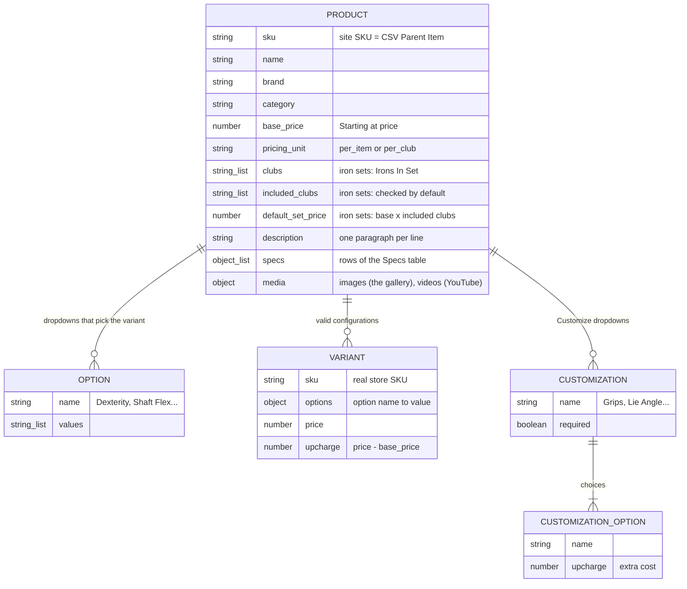
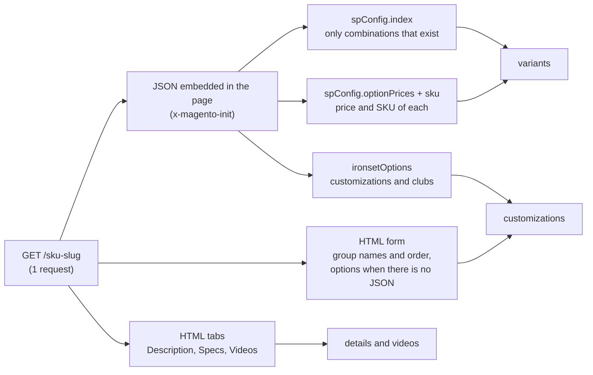
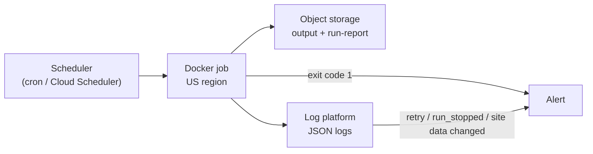
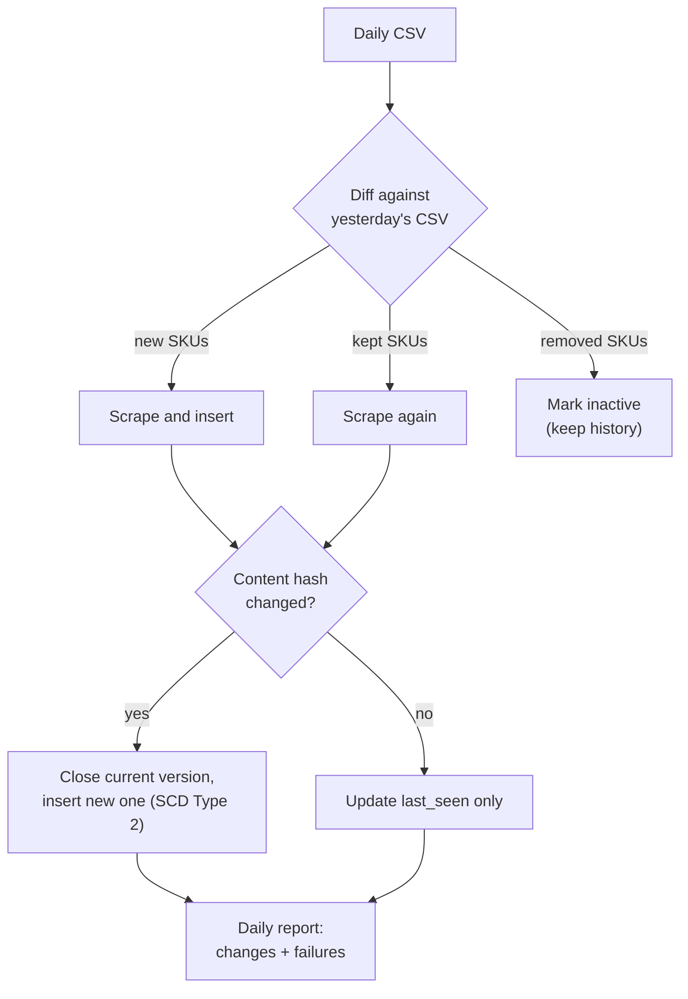

# retail-acquisition-engine — Documentation

Answers to the challenge questions. For the quick start and configuration, see
the [README](README.md).

| # | Question                                                   | Section                                                     |
| - | ---------------------------------------------------------- | ----------------------------------------------------------- |
| 1 | Data model                                                 | [Data model](#1-data-model)                                 |
| 2 | Conditional-option discovery                               | [Conditional options](#2-conditional-option-discovery)      |
| 3 | Runtime: trade-offs, how it was measured, where to improve | [Runtime](#3-runtime)                                       |
| 4 | Data that could not be captured reliably                   | [Not captured](#4-data-that-could-not-be-captured-reliably) |
| 5 | Run, monitor and maintain in production                    | [Production](#5-production)                                 |
| 6 | Daily CSV: new products, changes, history, flags           | [Daily pipeline](#6-daily-csv-pipeline-design)              |

## 1. Data model

One record per product in `output.json`, flattened into `variants.csv` and
`customizations.csv` for spreadsheets.



| Concept           | What it is                                         | Price rule                          |
| ----------------- | -------------------------------------------------- | ----------------------------------- |
| **Variant**       | A combination sold as its own SKU (hand × shaft × flex…) | Absolute `price`; `upcharge = price − base_price` |
| **Customization** | A Customize dropdown (grip, lie, length…). `required` on the 57 products where the site forces them all (45 driver shafts, 8 hybrid shafts, 4 L.A.B. Golf putters) | Each option's `upcharge` adds to the variant's price |
| **Iron sets**     | `pricing_unit: "per_club"`. `clubs`: the Irons In Set checkboxes; `included_clubs`: the ones checked by default (4–PW in 70 of 103 sets) | Per club, multiplied by the clubs checked; `default_set_price` = `base_price` × `included_clubs` |

**Names follow the site:** `sku` is the site's product SKU (the CSV's
`Parent Item`); `options` / `values` are the variant dropdowns; `upcharge` is
the "+ $2.50" shown next to an option; `regular_price` is the price before a
sale (equal to `price` for every variant in this run). Values are kept exactly
as the site writes them. In the CSVs, `product_sku` and `product_name` say which
product each row belongs to.

A trimmed record (full examples in [`results/sample/output.json`](results/sample/output.json)):

```jsonc
{
  "sku": "PRO S4 STS", "name": "Mizuno Pro S-4 Iron Set",
  "brand": "Mizuno", "category": "Iron Set", "model": "Pro S-4",
  "url": "https://www.2ndswing.com/golf-clubs/iron-sets/mizuno-pro-s-4-iron-set/pro-s4-sts",
  "base_price": 215, "price_range": { "min": 215, "max": 275 }, "pricing_unit": "per_club",
  "clubs": ["3 Iron", "4 Iron", "5 Iron", "6 Iron", "7 Iron", "8 Iron", "9 Iron", "PW"],
  "included_clubs": ["4 Iron", "5 Iron", "6 Iron", "7 Iron", "8 Iron", "9 Iron", "PW"], "default_set_price": 1505,
  "description": "Who’s It For?\nDesigned for accomplished golfers who value the soft, responsive feel…",
  "specs": [{ "Club": "3", "Loft": "21°", "Length": "39.25\"", "Bounce": "3°", "Hand": "RH Only" }],
  "media": {
    "images": ["https://www.2ndswing.com/images/representative/PRO%20S4%20STS.jpg",
               "https://www.2ndswing.com/images/representative/PRO%20S4%20STS_2.jpg"],
    "videos": ["https://www.youtube.com/watch?v=1LNL-MUEc1Y"]
  },
  "options": [{ "code": "g2_dexterity", "name": "Dexterity", "values": ["Right Handed", "Left Handed"] }],
  "variants": [{ "sku": "C4605039",
                 "options": { "Dexterity": "Left Handed", "Shaft Material": "Graphite",
                              "Shaft Flex": "Stiff", "Shaft Model": "Aerotech SteelFiber i110" },
                 "price": 275, "regular_price": 275, "upcharge": 60 }],
  "customizations": [{ "name": "Ferrule", "required": false,
                       "options": [{ "name": "Black Standard", "upcharge": 0 },
                                   { "name": "ICON (Black/Blue/White)", "upcharge": 2.5 }] }],
  "scraped_at": "2026-10-07T22:56:39.165Z", "extraction_time_ms": 2508.2
}
```

## 2. Conditional-option discovery

The site (Magento 2) builds its dropdowns in the browser from JSON embedded in
the page. The scraper reads that JSON, so one request gives every valid
combination, with no clicking.



| Source                           | Gives                                                       |
| -------------------------------- | ----------------------------------------------------------- |
| `spConfig`                       | `options` (`attributes`); **only the combinations that exist** (`index`), which is the conditional logic itself; price and SKU of each (`optionPrices`, `sku`) |
| `ironsetOptions`                 | Customization upcharges, Irons In Set (`option_type: "clubs"`), default clubs, `forceRequireOptions` |
| HTML                             | Group names and order (in no JSON), options on the 66 pages without the JSON, the Description / Specs / Videos tabs, the canonical `url` |
| `/gallery/<SKU>.json` (2nd request) | `media.images`: the page's gallery. The page's own JSON only has the main photo, used if a product has no gallery |

**Example:** `OPUS SP BS WGS` has ~700,000 theoretical combinations
(6 bounces × 5 grinds × 9 lofts × 2 materials × 2 hands × 8 flexes × 81 shafts);
the index lists the **3,888** the store sells, and the output has exactly those.

**Accuracy:** a combination is kept only with a price and a value for every
option, and the page's SKU must match the CSV. Every JSON block is validated
with zod (a changed field fails the product with `site data changed in …`); for
the HTML parts, `run-report.json` counts the products that have each one
(`coverage`). On the 696 pages saved on 2026-10-07, the parser matched an
independent re-parse (a separate Python script) with 0 differences.

**Customizations** do not depend on other choices, and every upcharge is a
fixed amount, so it does not change with the variant. The site's JavaScript
makes some options require others (a non-standard length requires grip and grip
install; an upgrade shaft, tip and length); those rules are not in the output.

## 3. Runtime

Full runs of the current code with `CONCURRENCY=20 DELAY_MS=0`: 1,396 requests
(page + gallery), 0 retries, 0 blocks. The site's page cache matters more than
any setting:

| Run (UTC, 2026-10-07)                               | Time           | Per product (p50 · p95) |
| --------------------------------------------------- | -------------- | ----------------------- |
| 22:04, cache cold                                   | **1 min 52 s** | 2.7 s · 5.6 s           |
| 22:56, cache warm after another run (in `results/`) | **47 s**       | 1.1 s · 2.5 s           |

**Measured** with `performance.now()` around each product (`extraction_time_ms`)
and around the whole run; `run-report.json` has the total, products per minute,
p50 / p95 / max of that run and the pacing settings.

**Pacing:** with the defaults (4 parallel requests, a new product every 500 ms)
the 4 requests set the pace: 87 products per minute, 8 min 3 s (measured before
the gallery request). With 20, the 500 ms caps a run at 120 per minute. The
defaults stay conservative on purpose.

| Decision                         | Why                                               | Cost                                         |
| -------------------------------- | ------------------------------------------------- | -------------------------------------------- |
| HTTP + embedded JSON, no browser | One request has every configuration and price     | Depends on the JSON shape (zod catches changes) |
| URL built from the SKU (`LINK 2.2 PUT` → `/link-2dot2-put`) | The site search is disallowed by `robots.txt` and answered 406 after ~40 searches | Relies on the URL convention (SKU checked on the page) |
| Conservative defaults            | No blocks                                         | About 4 times slower than the runs above     |
| Backoff retries (5 s → 40 s), stop after 3 blocks | Survives throttling without hammering the site | A blocked run ends early and resumes later |

**Where to improve:** more parallel requests without the pace (2 min instead of
8; agree on a rate with the site first); stream `output.json` as JSON Lines
(~110 MB is built in memory); skip unchanged records by content hash in daily
runs. Tried and dropped: page and gallery at once (46 s against 47 s, twice the
requests in flight). The largest page (`VZN1 I CUSTOM PUT`, 11.9 MB) takes about
25 s with the cache cold, hence the 60 s timeout.

## 4. Data that could not be captured reliably

**4 of 700 products**, listed with the reason in `run-report.json`:

| SKU                    | Reason                                                     |
| ---------------------- | ---------------------------------------------------------- |
| `2026 HL MAX D WGS`    | Out of stock: the site shows $0.00 and no configurations   |
| `2026 HL MAX D FWG`    | Out of stock: same as above                                |
| `KM2 PUT`              | No product page (404); the site search finds nothing       |
| `STAFF MOD TG NEW WGS` | Redirects to a generic model page with no product data     |

**Not captured, or only partially:**

| Data                         | Why                                                                     |
| ---------------------------- | ----------------------------------------------------------------------- |
| Rules between customizations | Only in the site's JavaScript (see above); `required` covers the products where all are required |
| Stock per configuration      | Empty in the JSON; availability is only per product                     |
| Media files                  | Kept as URLs, not downloaded; no per-configuration images exist         |
| Add-ons and shipping time    | The "Add On" box (e.g. Tour B XS balls, $19.99) is a separate product; the shipping time per variant is in `spConfig.leadtimes`, not in the output |
| Group headers in selects     | "STANDARD / PREMIUM GRIPS", "STANDARD / CUSTOM SHAFTS" only say whether an option costs extra, as `upcharge` does |
| Specs of 7 products          | 6 have no Specs tab; `20 AKA OM-5 NEW PUT` writes them as prose         |
| Labels                       | As the site writes them, which varies ("Grip" / "Grips", "Length" / "LENGTH"); 24 products repeat an option, as the site does |

## 5. Production



| Area         | How                                                                         |
| ------------ | --------------------------------------------------------------------------- |
| **Run**      | The Docker image as a one-off job (Cloud Run Jobs, ECS Fargate or cron) in a US region, which gives the US IP without a VPN |
| **Monitor**  | Exit code 1 = bad run (nothing extracted or >10% failed); one JSON log file per run; `run-report.json` with success rate, products per minute, p95 and `coverage` to track over time |
| **Alert on** | `retry` / `run_stopped` (throttling or blocking), `site data changed in …` (parser needs updating), drops in `coverage` |
| **Maintain** | zod points at the field that changed; 37 offline tests (also in CI) cover parsing, pricing, retries, resume, the CSV files and the explorer; `make explorer` puts any product next to its live page. Interrupted runs resume from `state/scraper.db` |

## 6. Daily CSV pipeline (design)

An outline, not implemented.



| Question                  | Answer                                                                 |
| ------------------------- | ---------------------------------------------------------------------- |
| **Identify new products** | Diff today's CSV with yesterday's by `Parent Item`: new SKUs are scraped and inserted, removed ones marked inactive, never deleted |
| **Scrape**                | Every SKU once a day at a gentle pace (e.g. `CONCURRENCY=1 DELAY_MS=10000`, ~2 h). The run state is keyed by date, so a re-run the same day resumes |
| **Detect changes**        | SHA-256 of the record without `scraped_at` and `extraction_time_ms`. Same hash: nothing to write; different: classify the change (price, variant or customization added / removed / re-priced, out of stock, gone). Changes are frequent: in 13 h, 22,690 variant prices changed in 36 products |
| **Store history**         | SCD Type 2 in PostgreSQL: a change closes the current row (`valid_to`) and inserts a new one, instead of ~280,000 near-identical rows a day |
| **Flag changes**          | A daily summary (Slack or email): new products, price changes (moves above 10% for review), variants added or removed, products gone, and products the CSV marks active (`EOL` = No) that the site does not sell, like the 4 failures of this run |
| **Flag failures**         | Exit code 1, `coverage` drops, runtime above twice the usual, `site data changed in …`, repeated 406. Out-of-stock and not-found are status changes there, not failures |

| Table                  | Columns                                                                     |
| ---------------------- | --------------------------------------------------------------------------- |
| `products`             | `sku` PK, name, brand, category, active, first_seen, last_seen              |
| `product_versions`     | sku, content_hash, data JSONB, valid_from, valid_to, is_current             |
| `variant_prices`       | sku, product_sku, options JSONB, price, regular_price, upcharge, valid_from, valid_to, is_current |
| `customization_prices` | product_sku, customization, option, required, upcharge, valid_from, valid_to, is_current |
| `runs`                 | run_id, started_at, finished_at, ok, failed, requests, status               |
