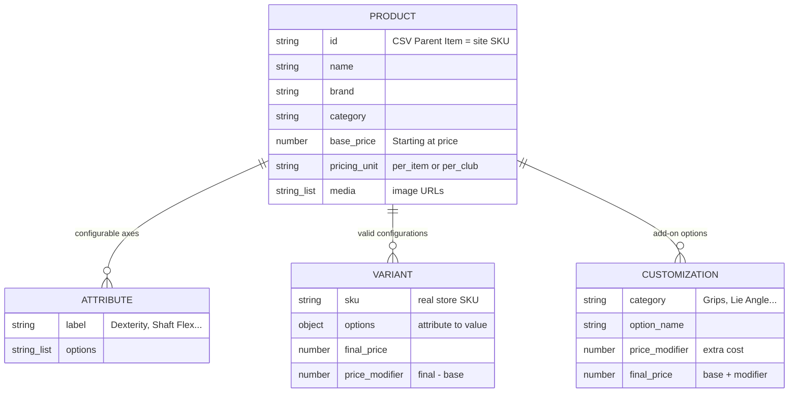
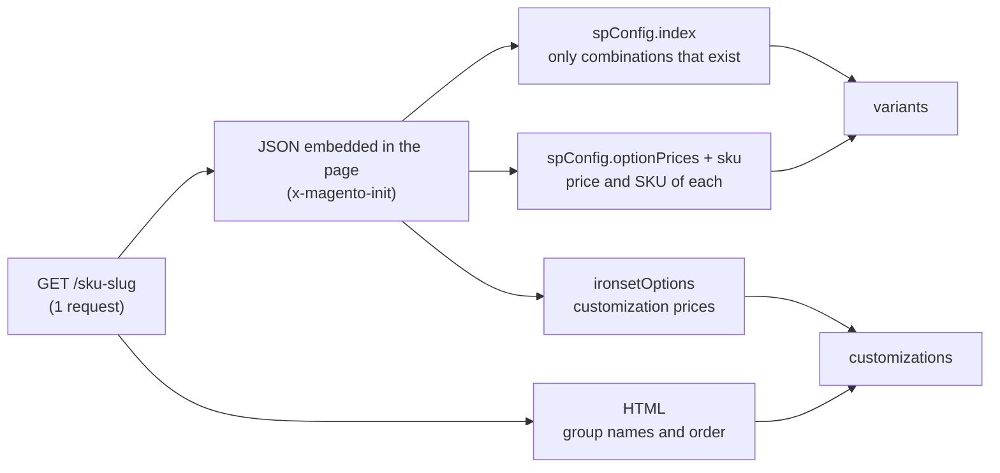
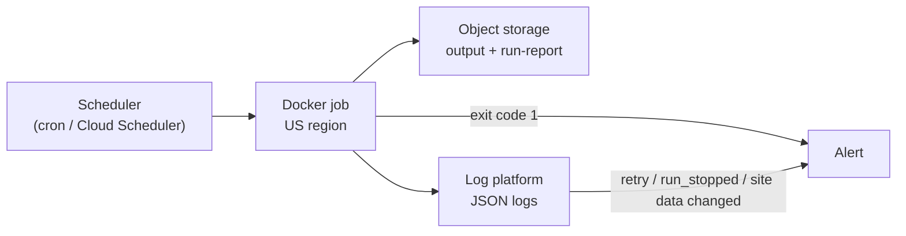
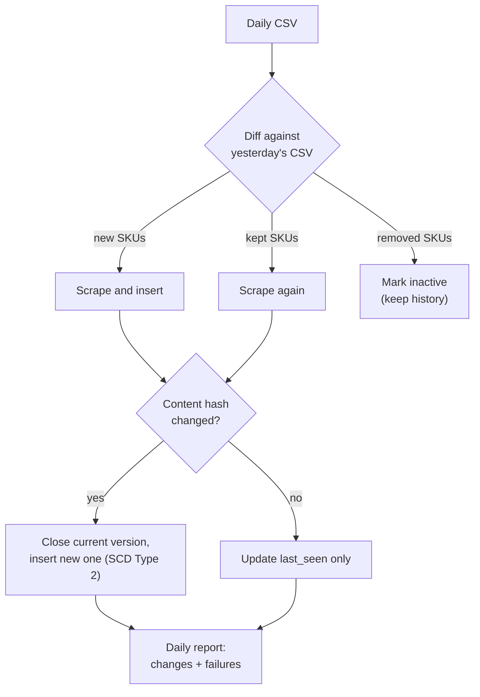

# retail-acquisition-engine — Documentation

Answers to the challenge questions. For the quick start and configuration, see
the [README](README.md).

| # | Question                                                        | Section                                                       |
| - | --------------------------------------------------------------- | ------------------------------------------------------------- |
| 1 | Data model                                                      | [Data model](#1-data-model)                                   |
| 2 | Conditional-option discovery                                    | [Conditional options](#2-conditional-option-discovery)        |
| 3 | Runtime: trade-offs, how it was measured, where to improve      | [Runtime](#3-runtime)                                         |
| 4 | Data that could not be captured reliably                        | [Not captured](#4-data-that-could-not-be-captured-reliably)   |
| 5 | Run, monitor and maintain in production                         | [Production](#5-production)                                   |
| 6 | Daily CSV: new products, changes, history, flags                | [Daily pipeline](#6-daily-csv-pipeline-design)                |

## 1. Data model

One record per product in `output.json`. The same data is flattened into
`variants.csv` and `customizations.csv` for spreadsheets.



| Concept           | What it is                                         | Price rule                          |
| ----------------- | -------------------------------------------------- | ----------------------------------- |
| **Variant**       | A combination the store sells as its own SKU (hand × shaft × flex…) | Absolute price; `price_modifier = final_price − base_price` |
| **Customization** | An add-on chosen on top (grip, lie, length…)       | Site gives the extra cost; `final_price = base_price + price_modifier` |
| **Iron sets**     | `pricing_unit: "per_club"`                         | Both prices are per club            |

A trimmed record (full examples in [`results/sample/output.json`](results/sample/output.json)):

```jsonc
{
  "id": "PRO S4 STS", "name": "Mizuno Pro S-4 Iron Set", "brand": "Mizuno",
  "base_price": 215, "pricing_unit": "per_club",
  "price_range": { "min": 215, "max": 275 },
  "media": ["https://www.2ndswing.com/images/standard/PRO%20S4%20STS.jpg"],
  "attributes": [{ "label": "Dexterity", "options": ["Right Handed", "Left Handed"] }],
  "variants": [{ "sku": "C4605039", "options": { "Dexterity": "Left Handed", "Shaft Flex": "Stiff" },
                 "final_price": 275, "price_modifier": 60 }],
  "customizations": [{ "category": "Ferrule", "option_name": "ICON (Black/Blue/White)",
                       "price_modifier": 2.5, "final_price": 217.5 }],
  "extraction_time_ms": 2222, "scraped_at": "2026-10-07T04:03:47.966Z"
}
```

## 2. Conditional-option discovery

The site (Magento 2) builds its dropdowns in the browser from JSON embedded in
the page. The scraper reads that JSON directly, so one request returns every
valid combination, with no clicking.



| Source in the page             | Gives                                                       |
| ------------------------------ | ----------------------------------------------------------- |
| `spConfig.attributes`          | Each configurable axis and its options                      |
| `spConfig.index`               | **Only the combinations that exist**: this is the conditional logic the page applies when you pick options |
| `spConfig.optionPrices`, `sku` | Price and SKU of each combination                           |
| `ironsetOptions.optionConfig`  | Customization options and their extra cost                  |
| HTML labels                    | Group names ("Grips") and display order (not in any JSON; GraphQL returns null for them) |

**Example:** the OPUS SP wedge has ~700,000 theoretical combinations
(6 bounces × 5 grinds × 9 lofts × 2 materials × 2 hands × 8 flexes × 81 shafts).
The index lists the **3,888** the store actually sells, and the output contains
exactly those.

**Accuracy checks:**
- Attributes are sorted by their `position` field, so they keep the page's selection order.
- A combination is kept only if it has a price and a value for every attribute.
- The SKU on the page must match the CSV, so a wrong product is never recorded.
- Every JSON block is validated with zod: if the site changes a field, the product fails with `site data changed in …` instead of producing empty data.

Customizations are not conditional: the JSON exposes no dependency between them.

## 3. Runtime

**Result:** 700 products in **8 min 3 s** with the defaults: 696 captured,
0 retries, 0 blocks.

### Trade-offs

| Decision                              | Why                                                    | Cost                                         |
| ------------------------------------- | ------------------------------------------------------ | -------------------------------------------- |
| HTTP + embedded JSON, no browser      | One request per product returns everything; a browser adds seconds and hundreds of MB per page | Depends on the site's JSON shape (mitigated by zod) |
| Direct URL from the SKU (`LINK 2.2 PUT` → `/link-2dot2-put`) | Avoids the site search (see below)                    | Relies on the site's URL convention (SKU checked on the page) |
| 4 in parallel, 1 new product every 500 ms | Considerate pace with no blocks                       | Slower than the site can take (see the test below) |
| Retries with backoff (5 s → 40 s), stop after 3 blocked products | Survives throttling without hammering the site | A blocked run ends early (and resumes later)  |

### Why not the site search

Both routes reach the same page and the same `x-magento-init` JSON; the direct
URL skips the search step. Tested from the same US IP:

| Check                        | Site search (`/catalogsearch/result/?q=…`) | Direct URL (`/link-2dot2-put`) |
| ---------------------------- | ------------------------------------------ | ------------------------------ |
| Requests per product         | 2 (search + redirect); 12 of 40 returned a list to pick from | 1 |
| [robots.txt](https://www.2ndswing.com/robots.txt) | `Disallow: /catalogsearch/`  | Allowed (no rule matches any of the 700 URLs) |
| After ~40 searches           | **406** (blocked)                          | **200**                        |
| 40 + 40 in parallel          | 40 × 406                                   | 40 × 200                       |
| Other headers / User-Agents  | Still 406 (the limit is per IP)            | –                              |

`robots.txt` only asks; the 406 is a separate per-IP limit on the search page.
Proxies would get around it, but the direct URL does not need it.

### How it was measured

`performance.now()` around each product (download + parse) gives
`extraction_time_ms`. The whole run is timed the same way, and
`run-report.json` reports the total, products per minute and p50 / p95 / max
per product.

### Concurrency test

The same 700 products from the same connection; all three captured identical
data:

| Setting                          | Time       | Products/min | Per product (p50 · p95) | 406 / retries / blocks |
| -------------------------------- | ---------- | ------------ | ----------------------- | ---------------------- |
| `CONCURRENCY=4`, `DELAY_MS=500`  | 8 min 3 s  | 87           | 2.4 s · 4.4 s           | 0 / 0 / 0              |
| `CONCURRENCY=20`, `DELAY_MS=500` | 6 min 5 s  | 115          | 2.2 s · 4.1 s           | 0 / 0 / 0              |
| `CONCURRENCY=20`, `DELAY_MS=0`   | **39 s**   | **1,074**    | 0.75 s · 2.8 s          | 0 / 0 / 0              |

The pace (`DELAY_MS`) limits speed, not concurrency: 500 ms caps the run at
120 products per minute. It is a single test (the last two runs overlapped by
~10 s), so the defaults stay conservative.

### Where to improve

| Improvement                                                  | Expected gain                                    |
| ------------------------------------------------------------ | ------------------------------------------------ |
| Faster pace, e.g. `CONCURRENCY=10`, `DELAY_MS=100`           | ~1.5 min instead of 8 (about 10 requests/s)      |
| Stream `output.json` as JSON Lines                           | Flat memory (today it is built in memory, ~110 MB) |
| Daily runs: skip unchanged records by content hash           | Less storage and processing, not fewer requests  |

Large pages dominate the time: the OPUS wedge page is 2.6 MB (1.1 s to
download, 0.5 s to parse), and the largest product (26,400 variants) took 20 s.

## 4. Data that could not be captured reliably

**4 of 700 products**, listed with the reason in `run-report.json`:

| SKU                    | Reason                                                     |
| ---------------------- | ---------------------------------------------------------- |
| `2026 HL MAX D WGS`    | Out of stock: the site shows $0.00 and no configurations   |
| `2026 HL MAX D FWG`    | Out of stock: same as above                                |
| `KM2 PUT`              | No product page (404); the site search finds nothing       |
| `STAFF MOD TG NEW WGS` | Redirects to a generic model page with no product data     |

**Not captured, or only partially:**

| Data                                   | Why                                                                     |
| -------------------------------------- | ----------------------------------------------------------------------- |
| Total price of an iron set             | Prices are per club and the number of clubs is a separate choice; `included_clubs` lists the default set |
| Dependencies between customizations    | Not in the site's JSON (e.g. grip size per grip model)                  |
| Stock per configuration                | The stock field is empty in the JSON; availability is only per product  |
| Media files                            | Captured as image URLs, not downloaded. One image per SKU (`standard` and `representative`); no per-configuration images exist |

## 5. Production



| Area         | How                                                                         |
| ------------ | --------------------------------------------------------------------------- |
| **Run**      | The Docker image as a one-off job (Cloud Run Jobs, ECS Fargate or cron) in a US region, which provides the US IP without a VPN. Settings via environment variables. |
| **Monitor**  | Exit code 1 = bad run (nothing extracted or >10% failed). One JSON log file per run (`product_ok`, `product_failed`, `retry`, `run_stopped`…). `run-report.json` gives success rate, products/min and p95 to track over time. |
| **Alert on** | `retry` / `run_stopped` events (site throttling or blocking) and `site data changed in …` errors (parser needs updating) |
| **Maintain** | zod schemas pinpoint which field changed. 21 offline tests (`make test`) cover parsing, pricing, retries, resume and the quality check. Interrupted runs resume from `state/scraper.db`. |

## 6. Daily CSV pipeline (design)

An outline, not implemented.



| Question                         | Answer                                                                 |
| -------------------------------- | ---------------------------------------------------------------------- |
| **Identify new products**        | Compare today's CSV with yesterday's by `Parent Item`: new SKUs are scraped and inserted; removed SKUs are marked inactive, never deleted |
| **Scrape**                       | Every SKU once a day at a gentle pace (e.g. `CONCURRENCY=1 DELAY_MS=10000`, ~2 h, fine for an unattended job). The run state is keyed by date, so a re-run the same day resumes instead of duplicating |
| **Detect changes**               | SHA-256 of the normalized record (sorted keys, without `scraped_at` and `extraction_time_ms`). Same hash: nothing to write. Different: compare fields to classify the change (base price, variant price, variant added/removed, customization added/removed/re-priced, out of stock, gone) |
| **Store history**                | SCD Type 2 in PostgreSQL: a change closes the current row (`valid_to`, `is_current = false`) and inserts a new one. Only changes are stored, instead of ~280,000 near-identical rows a day |
| **Flag changes**                 | One daily summary (Slack or email): new products, price changes (old → new, %; moves above 10% flagged for review), variants added or removed, products out of stock or gone |
| **Flag failures**                | Exit code 1, coverage drop, runtime above twice the usual, `site data changed in …`, repeated 406 (egress IP blocked or not in the US). Out-of-stock and not-found count as status changes, not failures |

Tables:

| Table                  | Columns                                                                     |
| ---------------------- | --------------------------------------------------------------------------- |
| `products`             | `sku` PK, name, brand, category, active, first_seen, last_seen              |
| `product_versions`     | sku, content_hash, data JSONB, valid_from, valid_to, is_current             |
| `variant_prices`       | variant_sku, product_sku, options JSONB, final_price, regular_price, valid_from, valid_to, is_current |
| `customization_prices` | product_sku, category, option_name, price_modifier, valid_from, valid_to, is_current |
| `runs`                 | run_id, started_at, finished_at, ok, failed, requests, status               |
