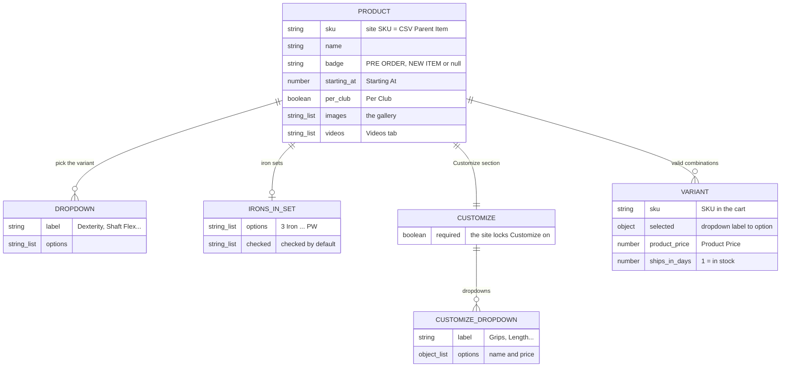
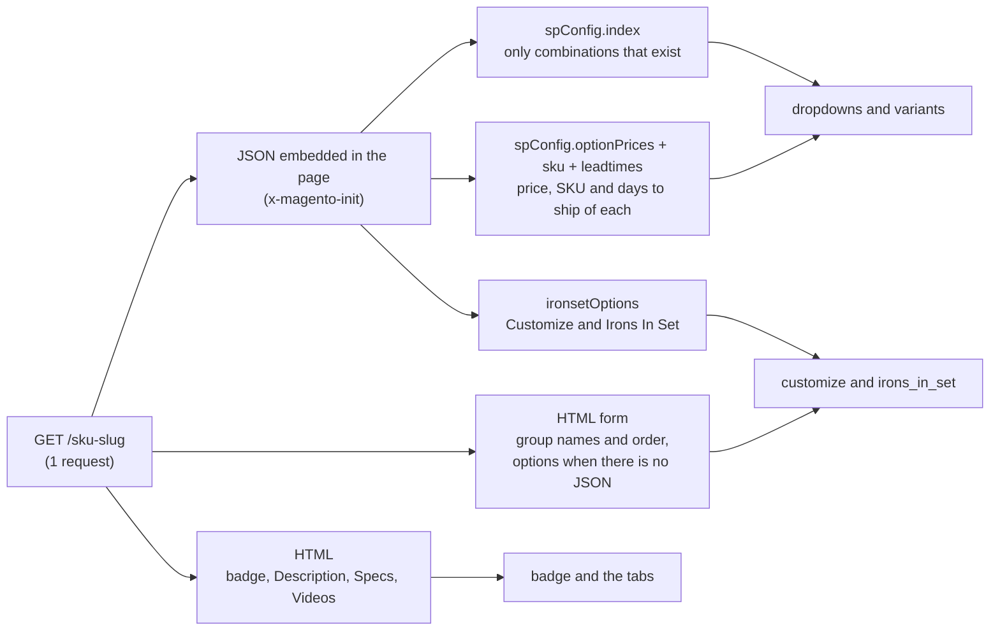
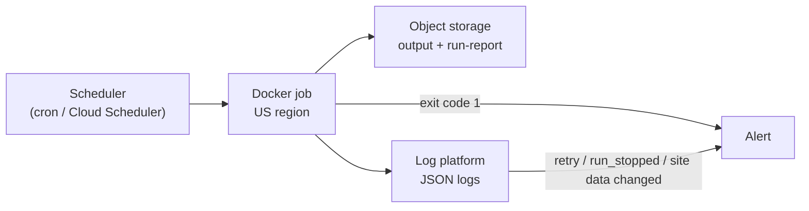
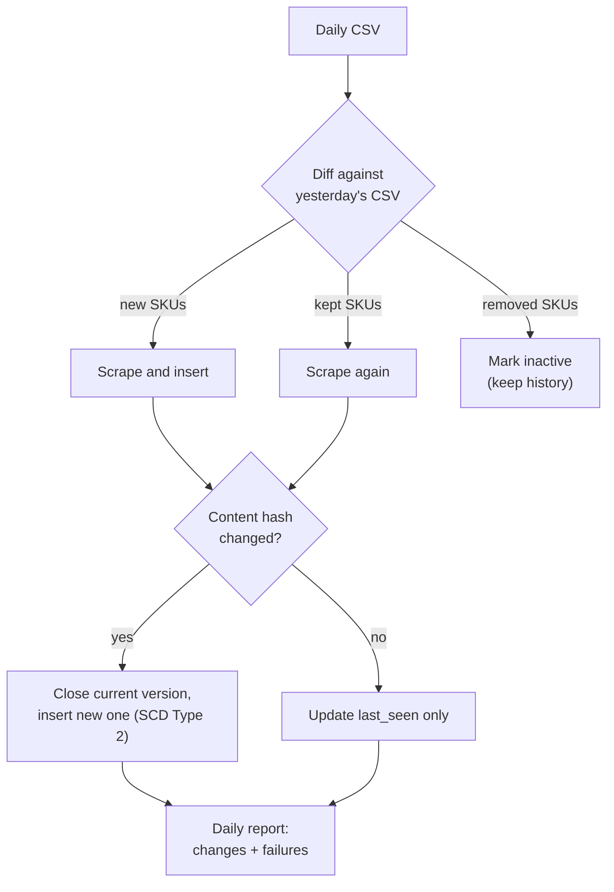

# retail-acquisition-engine — Documentation

Answers to the challenge questions. For the quick start and configuration, see
the [README](README.md).

| # | Question                                                   | Section                                                     |
| - | ---------------------------------------------------------- | ----------------------------------------------------------- |
| 1 | Data model                                                 | [Data model](#1-data-model)                                 |
| 2 | Conditional-option discovery                               | [Conditional options](#2-conditional-option-discovery)      |
| 3 | Runtime: trade-offs, how it was measured, where to improve | [Runtime](#3-runtime)                                       |
| 4 | Data that could not be captured reliably                   | [Not captured](#4-data-that-could-not-be-captured-reliably) |
| 5 | Run, monitor and maintain in production                    | [Production](#5-production)                                 |
| 6 | Daily CSV: new products, changes, history, flags           | [Daily pipeline](#6-daily-csv-pipeline-design)              |

## 1. Data model

One record per product in `output.json`, flattened into `variants.csv` and
`customizations.csv` for spreadsheets. Every field is named after what a
shopper sees on the product page, in the same order:

| On the product page                                         | In the output |
| ----------------------------------------------------------- | ------------- |
| The title, "Mizuno Pro S-4 Iron Set **(PRO S4 STS)**"       | `name`, `sku` |
| The ribbon over the photos, "PRE ORDER" or "NEW ITEM"       | `badge` |
| "**Starting At** $215.00 **Per Club**"                      | `starting_at`, `per_club` |
| The dropdowns that pick the variant: **Dexterity**, "Choose an **Option**…" | `dropdowns: [{ label, options }]` |
| The "**Irons In Set**" checkboxes of an iron set            | `irons_in_set: { options, checked }` |
| The **Customize** section and its switch (locked = "This is a **required** field.") | `customize: { required, dropdowns }` |
| A Customize option, "ICON (Black/Blue/White) **+ $2.50**"   | `{ "name": "ICON (Black/Blue/White)", "price": 2.5 }` |
| Each combination you can pick: "**SKU**" in the cart, "**Product Price**", "**Typically ships in 3 Weeks**" | `variants: [{ sku, selected, product_price, ships_in_days }]` |
| The photo gallery and the **Videos**, **Description** and **Specs** tabs | `images`, `videos`, `description`, `specs` |

`brand`, `category` and `model` come from the CSV; `scraped_at` and
`extraction_time_ms` describe the run.



**Prices.** `product_price` is the price of a variant and `starting_at` the
lowest one. A Customize option's `price` adds to it. Iron sets are priced per
club (`per_club`): the site multiplies the per-club price and the Customize
prices by the clubs checked (by default `irons_in_set.checked`, 4–PW in 70 of
the 103 sets).

**Required Customize.** On 57 products (45 driver shafts, 8 hybrid shafts and
4 L.A.B. Golf putters) the site locks Customize on and every one of its
dropdowns must be chosen: `customize.required` is true.

**Shipping.** `ships_in_days` is what the page turns into its shipping line:
1 is "In stock • Ships in 1 business day", more is "Typically ships in N Weeks"
(N = days ÷ 7, rounded up).

A trimmed record (full examples in [`results/sample/output.json`](results/sample/output.json)):

```jsonc
{
  "sku": "PRO S4 STS", "name": "Mizuno Pro S-4 Iron Set",
  "brand": "Mizuno", "category": "Iron Set", "model": "Pro S-4",
  "url": "https://www.2ndswing.com/golf-clubs/iron-sets/mizuno-pro-s-4-iron-set/pro-s4-sts",
  "badge": "NEW ITEM",
  "starting_at": 215, "per_club": true,
  "dropdowns": [{ "label": "Dexterity", "options": ["Right Handed", "Left Handed"] }],
  "irons_in_set": {
    "options": ["3 Iron", "4 Iron", "5 Iron", "6 Iron", "7 Iron", "8 Iron", "9 Iron", "PW"],
    "checked": ["4 Iron", "5 Iron", "6 Iron", "7 Iron", "8 Iron", "9 Iron", "PW"]
  },
  "customize": {
    "required": false,
    "dropdowns": [{ "label": "Ferrule", "options": [{ "name": "Black Standard", "price": 0 },
                                                    { "name": "ICON (Black/Blue/White)", "price": 2.5 }] }]
  },
  "variants": [{ "sku": "C4605039",
                 "selected": { "Dexterity": "Left Handed", "Shaft Material": "Graphite",
                               "Shaft Flex": "Stiff", "Shaft Model": "Aerotech SteelFiber i110" },
                 "product_price": 275, "ships_in_days": 21 }],
  "images": ["https://www.2ndswing.com/images/representative/PRO%20S4%20STS.jpg",
             "https://www.2ndswing.com/images/representative/PRO%20S4%20STS_2.jpg"],
  "videos": ["https://www.youtube.com/watch?v=1LNL-MUEc1Y"],
  "description": "Who’s It For?\nDesigned for accomplished golfers who value the soft, responsive feel…",
  "specs": [{ "Club": "3", "Loft": "21°", "Length": "39.25\"", "Bounce": "3°", "Hand": "RH Only" }],
  "scraped_at": "2026-10-08T01:39:31.642Z", "extraction_time_ms": 4210.8
}
```

## 2. Conditional-option discovery

The site (Magento 2) builds its dropdowns in the browser from JSON embedded in
the page. The scraper reads that JSON, so one request gives every valid
combination, with no clicking.



| Source                           | Gives                                                       |
| -------------------------------- | ----------------------------------------------------------- |
| `spConfig`                       | `dropdowns` (`attributes`); **only the combinations that exist** (`index`), which is the conditional logic itself; the price, SKU and days to ship of each (`optionPrices`, `sku`, `leadtimes`) |
| `ironsetOptions`                 | Customize prices (`optionConfig`), Irons In Set (`option_type: "clubs"`) and its checked clubs, `forceRequireOptions` (`customize.required`) |
| HTML                             | Customize labels and order (in no JSON), its options on the 66 pages without the JSON, the badge, the Description / Specs / Videos tabs, the canonical `url` |
| `/gallery/<SKU>.json` (2nd request) | `images`: the page's gallery. The page's own JSON only has the main photo, used if a product has no gallery |

**Example:** `OPUS SP BS WGS` has ~700,000 theoretical combinations
(6 bounces × 5 grinds × 9 lofts × 2 materials × 2 hands × 8 flexes × 81 shafts);
the index lists the **3,888** the store sells, and the output has exactly those.

**Accuracy:** a combination is kept only with a price and an option for every
dropdown, and the page's SKU must match the CSV. Every JSON block is validated
with zod (a changed field fails the product with `site data changed in …`); for
the HTML parts, `run-report.json` counts the products that have each one
(`coverage`). On the 696 pages saved on 2026-10-07, the parser matched an
independent re-parse (a separate Python script) with 0 differences.

**Customize** options do not depend on other choices, and every price is a fixed
amount, so it does not change with the variant. The site's JavaScript
makes some options require others (a non-standard length requires grip and grip
install; an upgrade shaft, tip and length); those rules are not in the output.

## 3. Runtime

Full runs of the current code with `CONCURRENCY=20 DELAY_MS=0`: 1,396 requests
(page + gallery), 0 retries, 0 blocks. The site's page cache matters more than
any setting:

| Run (UTC)                                            | Time           | Per product (p50 · p95) |
| ---------------------------------------------------- | -------------- | ----------------------- |
| 2026-10-08 01:39, cache cold (the run in `results/`) | **1 min 57 s** | 2.8 s · 6.0 s           |
| 2026-10-07 22:56, cache warm after another run       | **47 s**       | 1.1 s · 2.5 s           |

**Measured** with `performance.now()` around each product (`extraction_time_ms`)
and around the whole run; `run-report.json` has the total, products per minute,
p50 / p95 / max of that run and the pacing settings.

**Pacing:** with the defaults (4 parallel requests, a new product every 500 ms)
the 4 requests set the pace: 87 products per minute, 8 min 3 s (measured before
the gallery request). With 20, the 500 ms caps a run at 120 per minute. The
defaults stay conservative on purpose.

| Decision                         | Why                                               | Cost                                         |
| -------------------------------- | ------------------------------------------------- | -------------------------------------------- |
| HTTP + embedded JSON, no browser | One request has every configuration and price     | Depends on the JSON shape (zod catches changes) |
| URL built from the SKU (`LINK 2.2 PUT` → `/link-2dot2-put`) | The site search is disallowed by `robots.txt` and answered 406 after ~40 searches | Relies on the URL convention (SKU checked on the page) |
| Conservative defaults            | No blocks                                         | About 4 times slower than the runs above     |
| Backoff retries (5 s → 40 s), stop after 3 blocks | Survives throttling without hammering the site | A blocked run ends early and resumes later |

**Where to improve:** more parallel requests without the pace (2 min instead of
8; agree on a rate with the site first); stream `output.json` as JSON Lines
(~110 MB is built in memory); skip unchanged records by content hash in daily
runs. Tried and dropped: page and gallery at once (46 s against 47 s, twice the
requests in flight). The largest page (`VZN1 I CUSTOM PUT`, 11.9 MB) takes 20–25 s
with the cache cold, hence the 60 s timeout.

## 4. Data that could not be captured reliably

**4 of 700 products**, listed with the reason in `run-report.json`:

| SKU                    | Reason                                                     |
| ---------------------- | ---------------------------------------------------------- |
| `2026 HL MAX D WGS`    | Out of stock: the site shows $0.00 and no configurations   |
| `2026 HL MAX D FWG`    | Out of stock: same as above                                |
| `KM2 PUT`              | No product page (404); the site search finds nothing       |
| `STAFF MOD TG NEW WGS` | Redirects to a generic model page with no product data     |

**Not captured, or only partially:**

| Data                         | Why                                                                     |
| ---------------------------- | ----------------------------------------------------------------------- |
| Rules between Customize options | Only in the site's JavaScript (see above); `customize.required` covers the products where all are required |
| Stock count                  | The JSON has none; `ships_in_days` = 1 marks the variants in stock      |
| Media files                  | Kept as URLs, not downloaded; no per-configuration images exist         |
| Add-ons                      | The "Add On" box (e.g. Tour B XS balls, $19.99) is a separate product   |
| Group headers in dropdowns   | "STANDARD / PREMIUM GRIPS", "STANDARD / CUSTOM SHAFTS" only say whether an option costs extra, as its `price` does |
| Reviews                      | A third-party widget (Yotpo) loads them after the page opens; they are not in the page |
| Specs of 7 products          | 6 have no Specs tab; `20 AKA OM-5 NEW PUT` writes them as prose         |
| Labels                       | As the site writes them, which varies ("Grip" / "Grips", "Length" / "LENGTH"); 24 products repeat an option, as the site does |

## 5. Production



| Area         | How                                                                         |
| ------------ | --------------------------------------------------------------------------- |
| **Run**      | The Docker image as a one-off job (Cloud Run Jobs, ECS Fargate or cron) in a US region, which gives the US IP without a VPN |
| **Monitor**  | Exit code 1 = bad run (nothing extracted or >10% failed); one JSON log file per run; `run-report.json` with success rate, products per minute, p95 and `coverage` to track over time |
| **Alert on** | `retry` / `run_stopped` (throttling or blocking), `site data changed in …` (parser needs updating), drops in `coverage` |
| **Maintain** | zod points at the field that changed; 37 offline tests (also in CI) cover parsing, pricing, retries, resume, the CSV files and the explorer; `make explorer` puts any product next to its live page. Interrupted runs resume from `state/scraper.db` |

## 6. Daily CSV pipeline (design)

An outline, not implemented.



| Question                  | Answer                                                                 |
| ------------------------- | ---------------------------------------------------------------------- |
| **Identify new products** | Diff today's CSV with yesterday's by `Parent Item`: new SKUs are scraped and inserted, removed ones marked inactive, never deleted |
| **Scrape**                | Every SKU once a day at a gentle pace (e.g. `CONCURRENCY=1 DELAY_MS=10000`, ~2 h). The run state is keyed by date, so a re-run the same day resumes |
| **Detect changes**        | SHA-256 of the record without `scraped_at` and `extraction_time_ms`. Same hash: nothing to write; different: classify the change (price, shipping time, variant or Customize option added / removed / re-priced, out of stock, gone). Changes are frequent: in 13 h, 22,690 variant prices changed in 36 products |
| **Store history**         | SCD Type 2 in PostgreSQL: a change closes the current row (`valid_to`) and inserts a new one, instead of ~280,000 near-identical rows a day |
| **Flag changes**          | A daily summary (Slack or email): new products, price changes (moves above 10% for review), variants added or removed, products gone, and products the CSV marks active (`EOL` = No) that the site does not sell, like the 4 failures of this run |
| **Flag failures**         | Exit code 1, `coverage` drops, runtime above twice the usual, `site data changed in …`, repeated 406. Out-of-stock and not-found are status changes there, not failures |

| Table                  | Columns                                                                     |
| ---------------------- | --------------------------------------------------------------------------- |
| `products`             | `sku` PK, name, brand, category, active, first_seen, last_seen              |
| `product_versions`     | sku, content_hash, data JSONB, valid_from, valid_to, is_current             |
| `variant_prices`       | sku, product_sku, selected JSONB, product_price, ships_in_days, valid_from, valid_to, is_current |
| `customize_prices`     | product_sku, dropdown, option, price, required, valid_from, valid_to, is_current |
| `runs`                 | run_id, started_at, finished_at, ok, failed, requests, status               |
