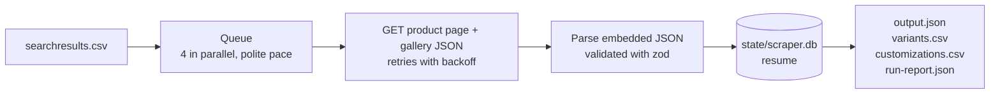

# retail-acquisition-engine

A scraper for [2ndswing.com](https://www.2ndswing.com) that turns a CSV of product
SKUs into structured data: details (description and specs), images and videos,
every valid configuration (hand, shaft, flex, loft…) and every customization
option (grips, lie, length…), each with its price.

It uses plain HTTP requests and reads the JSON that the store (Magento 2) embeds
in each product page: no headless browser, and per product one page plus one
small JSON with its photo gallery. It resumes
after interruptions, retries when the site pushes back, and stops on its own if
it keeps getting blocked.

## Results

Full run of the 700 products in `searchresults.csv` (output in [`results/`](results/)):

| Metric                | Value                                              |
| --------------------- | -------------------------------------------------- |
| Products captured     | **696 / 700** (the other 4 are not available on the site) |
| Valid configurations  | **280,886**, each with its price                   |
| Customization options | **38,983**, each with its upcharge; on 57 products the site requires them |
| Details and media     | Description for all 696, specs table for 689, 3,397 images (every gallery), 852 YouTube videos on 535 products |
| Requests              | 1,396 (page + gallery per product), 0 retries, 0 blocks |
| Runtime               | **1 min 52 s** with `CONCURRENCY=20 DELAY_MS=0`, or 47 s right after another run (the site's cache is warm) · about 8 min with the defaults |

**No US IP?** You can still browse the results (after `make install`):
`OUTPUT_DIR=results/sample make explorer` shows the 5 sample products, and
`unzip results/full-results.zip -d data && make explorer` all 696. The zip holds
`output.json`, both CSVs, `run-report.json` and the run's log (188 MB unzipped).

## Features

- **Every valid configuration with its price**, including combinations that the
  site only reveals after several clicks
- **Customization options with their upcharge**, grouped and ordered as the
  site shows them, including those that only exist in the page's HTML form,
  and whether the site requires them
- **Product details and media:** description, specs table, every image of the
  gallery and the YouTube videos
- **Iron sets:** per-club prices, the clubs each set can include and the price
  of its default set
- **Explorer:** search the products by product or variant SKU, name or brand,
  and check each one against its live page (`make explorer`)
- **Checked site data:** every JSON block it reads is validated, so a changed
  field fails the product with a clear error; `run-report.json` also counts the
  products with variants, description, specs, images…, so an empty field shows up
  as a drop
- **Resumable:** progress is saved per product; running it again continues where
  it stopped
- **Polite by default:** limited parallel requests and pace, retries with
  exponential backoff, and an automatic stop after 3 blocks in a row
- **Ready for schedulers:** JSON and CSV output, a run report, one log file per
  run, and exit code 1 when a run goes wrong

## How it works



Each product's page already contains every valid configuration and its price,
so one request is enough for them; a second, small one brings the photo gallery.
Details in
[Conditional-option discovery](DOCUMENTATION.md#2-conditional-option-discovery).

## Requirements

> [!IMPORTANT]
> The scraper needs a **US IP address**. From other countries the site answers
> HTTP 406 to every product page, and the run stops after 3 blocked products.
> Outside the US, use a US VPN; Docker uses the host's network, so the VPN
> covers it too.

- Node.js 24 and pnpm 10 (run `corepack enable` to get pnpm), or Docker
- `make` is optional: every target maps to a `pnpm` script

## Quick start

```bash
make install        # or: pnpm install
make dev LIMIT=10   # scrape the first 10 products of searchresults.csv
```

The console shows each product as it finishes, then a summary:

```text
INFO  Scraper: Starting the scraper. {"input":"searchresults.csv","products":10,"concurrency":4,"delay_ms":500,"state":"data/state/scraper.db"}
INFO  Scraper: [1/10] M CRAFT X S3 PUT {"variants":26,"customization_options":22,"ms":1187}
…
INFO  Scraper: Finished! Total 10 products: 10 succeeded, 0 failed (20 requests, 5s).
INFO  Scraper: Output saved: {"files":["data/output.json","data/run-report.json","data/variants.csv","data/customizations.csv","data/logs/run-2026-10-07T23-00-15.log"]}
```

Run `make dev` (no `LIMIT`) to scrape all the products in the CSV.

## Usage

| Command                     | What it does                                       |
| --------------------------- | -------------------------------------------------- |
| `make dev`                  | Scrape every product in the CSV                    |
| `make dev LIMIT=10`         | Scrape only the first 10 (quick test)              |
| `make explorer`             | Browse the products at `http://localhost:4321`: search by product or variant SKU, name or brand; see each one laid out like the store page |
| `make test`                 | Typecheck and run the tests (no network needed)    |
| `make build` / `make start` | Compile to `dist/` and run the compiled version    |
| `make reset`                | Delete all output and the resume state             |
| `make docker-build`         | Build the Docker image                             |
| `make docker-run LIMIT=10`  | Run in Docker (output goes to `data_docker/`)      |
| `make`                      | List every command                                 |

**Interrupted runs:** press Ctrl+C or lose the VPN, then run the same command
again. Products already scraped are not requested again, so running a finished
run again only retries its failed products. To scrape everything again, delete
`data/state/` first (`make reset` deletes all output).

**Exit code:** `0` on success, `1` if nothing was extracted or more than 10% of
the products failed.

## Output

Everything goes to `data/` (`data_docker/` with Docker):

| File                   | Content                                                    |
| ---------------------- | ---------------------------------------------------------- |
| `output.json`          | One record per product: details, media, options, variants, customizations |
| `variants.csv`         | One row per valid configuration, with its price            |
| `customizations.csv`   | One row per customization option, with its upcharge and whether it is required |
| `run-report.json`      | Run metrics and each failed product with the reason        |
| `logs/run-<start>.log` | One file per run, one JSON line per event                  |
| `state/scraper.db`     | Resume state (internal, not part of the results)           |

A row of `variants.csv`:

```csv
"product_sku","product_name","sku","options","base_price","upcharge","price","pricing_unit"
"M CRAFT X S3 PUT","Mizuno M.Craft X S3 Putter","C4613215","{""Dexterity"":""Left Handed"",""Club Length"":""32.0in""}","399.99","0","399.99","per_item"
```

The full record format is described in the
[documentation](DOCUMENTATION.md#1-data-model). A 5-product sample is in
[`results/sample/`](results/sample/).

Some option names start with "+" or "-" (`+ 1 Wrap`, `- .50"`). Spreadsheets
may read them as formulas: import the CSVs as text (in Excel, Data → From
Text/CSV) to keep them as written.

## Configuration

Optional: copy `.env.example` to `.env`. The same file works for `make dev` and
Docker. Any variable can also be set on the command line
(`CONCURRENCY=10 make dev`); `make docker-run` only passes `LIMIT` that way.

| Variable           | Default             | Description                                              |
| ------------------ | ------------------- | -------------------------------------------------------- |
| `INPUT_CSV`        | `searchresults.csv` | CSV with a `Parent Item` column (the site's SKU)         |
| `OUTPUT_DIR`       | `data`              | Folder for results, logs and resume state (`data_docker` with Docker) |
| `LIMIT`            | `0`                 | Products to scrape; `0` = all                            |
| `CONCURRENCY`      | `4`                 | Requests in parallel                                     |
| `DELAY_MS`         | `500`               | At most one product starts every `DELAY_MS`              |
| `RETRIES`          | `4`                 | Retries per request on 406, 429, 5xx and network errors  |
| `RETRY_DELAY_MS`   | `5000`              | First retry wait; doubles on each retry                  |
| `TIMEOUT_MS`       | `60000`             | Timeout per request                                      |
| `MAX_ATTEMPTS`     | `5`                 | Runs a product may fail before it is abandoned           |
| `MAX_FAILURE_RATE` | `0.1`               | Above this failure rate the run exits with code 1        |
| `USER_AGENT`       | a desktop Chrome    | User-Agent sent with every request                       |

**Speed:** with the defaults, the 4 parallel requests set the pace (87 products
per minute, 8 min, measured before the gallery request); with more of them,
`DELAY_MS=500` caps a run at 120 products per minute. The last full runs used `CONCURRENCY=20 DELAY_MS=0`: 1,396
requests without retries or blocks, in 1 min 52 s, or 47 s right after another
run, while the site still has the pages cached. The defaults stay conservative on
purpose; see [Runtime](DOCUMENTATION.md#3-runtime).

## Project structure

```text
src/
├── main.ts        entry point: run, report, exit code
├── config.ts      settings from environment variables
├── scrape/        queue, resume, metrics
├── extract/       parsing: variants, customizations, details, media, zod schemas
└── lib/           HTTP client, CSV, SQLite state, logging, output files
explorer/          web explorer: server.ts (API) + public/ (page, styles, script)
test/              38 offline tests
results/           output of the full run (sample/ + full-results.zip)
```

## Documentation

[DOCUMENTATION.md](DOCUMENTATION.md) answers the challenge questions, with
diagrams and tables:

1. [Data model](DOCUMENTATION.md#1-data-model)
2. [Conditional-option discovery](DOCUMENTATION.md#2-conditional-option-discovery)
3. [Runtime: trade-offs, measurement, improvements](DOCUMENTATION.md#3-runtime)
4. [Data that could not be captured](DOCUMENTATION.md#4-data-that-could-not-be-captured-reliably)
5. [Production: run, monitor, maintain](DOCUMENTATION.md#5-production)
6. [Daily CSV pipeline design](DOCUMENTATION.md#6-daily-csv-pipeline-design)

## License

[MIT](LICENSE)
