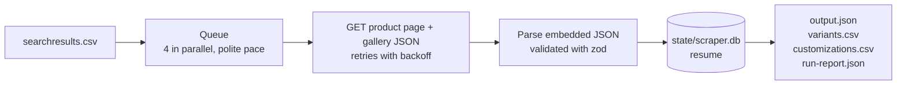

# retail-acquisition-engine

[](https://github.com/RLFreddy/retail-acquisition-engine/actions/workflows/ci.yml)
[](#requirements)
[](LICENSE)
[](https://github.com/RLFreddy)

A scraper for [2ndswing.com](https://www.2ndswing.com) that turns a CSV of product
SKUs into structured data.

- **What you get:** for each product, its details (description, specs), images and
  videos, **every valid configuration** (hand, shaft, flex, loft…) and **every
  Customize option** (grips, lie, length…), each with its price.
- **How:** plain HTTP requests that read the JSON the store (Magento 2) embeds in
  each product page. No headless browser: one page and one small gallery JSON
  per product.
- **Runs unattended:** it resumes after interruptions, retries when the site
  pushes back, and stops on its own if it keeps getting blocked.


## What's included

| What                              | Where                                                                  |
| --------------------------------- | ---------------------------------------------------------------------- |
| Source code and how to run it     | [`src/`](src/), [Installation](#installation) and [Quick start](#quick-start) |
| Structured output (JSON and CSV)  | [`results/`](results/): `full-results.zip` (all 696 products) and `sample/` (5, unzipped) ([Output](#output)) |
| How it works and why: data model, conditional options, accuracy, runtime, production, daily design | [DESIGN.md](DESIGN.md) ([sections](#documentation)) |

## Results

Full run of the 700 products in `searchresults.csv` (output in [`results/`](results/)):

| Metric                | Value                                              |
| --------------------- | -------------------------------------------------- |
| Products captured     | **696 / 700** (the other 4 are not available on the site) |
| Valid configurations  | **280,886**, each with its price and days to ship  |
| Customize options     | **38,983**, each with its price; on 57 products the site requires them |
| Details and media     | Description for all 696, specs table for 689, 3,397 images (every gallery), 852 YouTube videos on 535 products, the badge of 21 ("PRE ORDER", "NEW ITEM") |
| Requests              | 1,396 (the page and its gallery for each product), 0 retries, 0 blocks |
| Runtime               | **1 min 57 s** with `CONCURRENCY=20 DELAY_MS=0`; about 8 min with the polite defaults |

> [!TIP]
> **No US IP?** You can still browse the results (after `make install`):
> `OUTPUT_DIR=results/sample make explorer` shows the 5 sample products, and
> `unzip results/full-results.zip -d data && make explorer` all 696. The zip holds
> `output.json`, both CSVs, `run-report.json` and the run's log (182 MB unzipped).

## Features

- **Named like the product page:** every field is something a shopper sees there
  ("Starting At", the dropdowns, "Irons In Set", "Customize", "Product Price"…)
- **Every valid configuration,** including those the site reveals only after
  several clicks, each with its SKU, price and days to ship
- **Customize options with their prices,** grouped and ordered as the site shows
  them (even those only in the page's HTML form), and whether the site requires them
- **Iron sets:** per-club prices and the Irons In Set clubs, with the ones checked
  by default
- **Checked data:** every JSON block it reads is validated, so a change on the site
  fails the product with a clear error; the run report counts the products that
  have each field, so a missing one shows up as a drop
- **Explorer:** browse the results in three views ([Explorer](#explorer))

## How it works



Why this approach, and how the page's JSON gives every combination: see
[Approach](DESIGN.md#1-approach) and
[Conditional options](DESIGN.md#3-conditional-options-and-price-changes).

## Requirements

> [!IMPORTANT]
> The scraper needs a **US IP address**. From other countries the site answers
> HTTP 406 to every product page, and the run stops after 3 blocked products.
> Outside the US, use a US VPN; Docker's traffic goes out through your machine,
> so the VPN covers it too.

| Tool    | Version                                   | Notes                                                  |
| ------- | ----------------------------------------- | ------------------------------------------------------ |
| Node.js | 24 (exactly 24.10.0, from `.nvmrc`)       | Docker and CI use the same version                     |
| pnpm    | 10 (exactly 10.14.0, from `package.json`) | Corepack installs it                                   |
| make    | Any                                       | Optional: every target maps to a `pnpm` script         |
| Docker  | With Compose 2.24 or later                | Only for the Docker install, which needs nothing else  |

No compiler is needed: the SQLite driver ships prebuilt binaries for Linux,
macOS and Windows. Tested on Linux (Ubuntu, in CI) and on Windows with WSL2.

## Installation

### With Node

1. **Get the code:**

   ```bash
   git clone https://github.com/RLFreddy/retail-acquisition-engine.git
   cd retail-acquisition-engine
   ```

2. **Install Node and pnpm** at the pinned versions:

   ```bash
   nvm install          # Node 24.10.0, read from .nvmrc
   corepack enable      # pnpm 10.14.0, read from package.json
   node -v && pnpm -v   # v24.10.0 and 10.14.0
   ```

   - Without nvm, install Node 24 from [nodejs.org](https://nodejs.org).
   - Node 25 and later no longer include Corepack: run `npm install -g corepack` first.
   - The first `pnpm` command may ask to download pnpm 10.14.0: answer `Y`.

3. **Install the dependencies:**

   ```bash
   make install         # or: pnpm install
   ```

4. **Check the installation** (no network or VPN needed):

   ```bash
   make test            # typecheck and 37 tests; ends with "pass 37"
   ```

### With Docker

The image brings Node and pnpm, so Docker is all you need:

```bash
git clone https://github.com/RLFreddy/retail-acquisition-engine.git
cd retail-acquisition-engine
make docker-build          # or: docker compose build
make docker-run LIMIT=10   # or: docker compose run --rm -e LIMIT=10 scraper
```

The results go to `data_docker/`.

## Quick start

With the project installed, scrape the first 10 products of `searchresults.csv`:

```bash
make dev LIMIT=10
```

The console shows each product as it finishes, then a summary:

```text
INFO  Scraper: Starting the scraper. {"input":"searchresults.csv","products":10,"concurrency":4,"delay_ms":500,"state":"data/state/scraper.db"}
INFO  Scraper: [1/10] M CRAFT X S3 PUT {"variants":26,"customization_options":22,"ms":1187}
…
INFO  Scraper: Finished! Total 10 products: 10 succeeded, 0 failed (20 requests, 5s).
INFO  Scraper: Output saved: {"files":["data/output.json","data/run-report.json","data/variants.csv","data/customizations.csv","data/logs/run-2026-10-07T23-00-15.log"]}
```

Run `make dev` (no `LIMIT`) to scrape all the products in the CSV. If the run
stops with "The site is blocking this IP", the site does not accept your IP: see
[Requirements](#requirements).

## Usage

| Command                     | What it does                                       |
| --------------------------- | -------------------------------------------------- |
| `make dev`                  | Scrape every product in the CSV                    |
| `make dev LIMIT=10`         | Scrape only the first 10 (quick test)              |
| `make dev LIMIT=50 CONCURRENCY=20 DELAY_MS=0` | Any setting after the command, for that run only, also with `make docker-run`: 50 products, 20 in parallel, no pause ([Configuration](#configuration)) |
| `make explorer`             | Browse the results at `http://localhost:4321` ([Explorer](#explorer)) |
| `make test`                 | Typecheck and run the tests (no network needed)    |
| `make build` / `make start` | Compile to `dist/` and run the compiled version    |
| `make reset`                | Delete all output and the resume state             |
| `make docker-build`         | Build the Docker image                             |
| `make docker-run LIMIT=10`  | Run in Docker (output goes to `data_docker/`)      |
| `make`                      | List every command                                 |

- **Interrupted runs:** press Ctrl+C or lose the VPN, then run the same command
  again. Products already scraped are not requested again, so running a finished
  run again only retries its failed products. To start over, delete `data/state/`
  (`make reset` deletes all output).
- **Exit code:** `0` on success, `1` if nothing was extracted or more than 10% of
  the products failed, so a scheduler can alert on it.

## Output

Everything goes to `data/` (`data_docker/` with Docker):

| File                   | Content                                                    |
| ---------------------- | ---------------------------------------------------------- |
| `output.json`          | One record per product, named and ordered like the product page |
| `variants.csv`         | One row per valid configuration, with its price and days to ship |
| `customizations.csv`   | One row per Customize option, with its price and whether it is required |
| `run-report.json`      | Run metrics and each failed product with the reason        |
| `logs/run-<start>.log` | One file per run, one JSON line per event                  |
| `state/scraper.db`     | Resume state (internal, not part of the results)           |

A row of `variants.csv`:

```csv
"product_sku","product_name","sku","selected","starting_at","product_price","ships_in_days","per_club"
"M CRAFT X S3 PUT","Mizuno M.Craft X S3 Putter","C4613215","{""Dexterity"":""Left Handed"",""Club Length"":""32.0in""}","399.99","399.99","21","false"
```

- **Full record format:** [Data model](DESIGN.md#2-data-model); a 5-product
  sample is in [`results/sample/`](results/sample/).
- **Spreadsheets:** some option names start with "+" or "-" (`+ 1 Wrap`, `- .50"`)
  and may be read as formulas. Import the CSVs as text (in Excel, Data → From
  Text/CSV) to keep them as written.

## Explorer

`make explorer` serves the results at `http://localhost:4321`
(`PORT=8080 make explorer` for another port). Every product opens in three views
of the same data, plus a link to its live page:

| View            | Address             | What it is for                                                  |
| --------------- | ------------------- | --------------------------------------------------------------- |
| **Explorer**    | `/`                 | Search by product or variant SKU, name or brand; each product's key facts (price range, variants, shipping, Customize), its JSON and where each field comes from |
| **Clone**       | `/clone.html`       | The store's product page rebuilt from the data, with the page's own rules: dropdowns that open in order, the price table, Customize, the shipping line and the Add to Cart checks |
| **Alternative** | `/alternative.html` | The same data, easier to read: choose options in any order and see the price of each one |

## Configuration

Every setting has a default (table below), so none is required. To change them
for one run, add them after the command:

```bash
# Locally
make dev LIMIT=50 CONCURRENCY=20 DELAY_MS=0                 # 50 products, 20 in parallel, no pause
LIMIT=50 CONCURRENCY=20 DELAY_MS=0 pnpm dev                 # the same, without make
make dev CONCURRENCY=20 DELAY_MS=0                          # every product, as fast as in Results
make dev INPUT_CSV=new-skus.csv OUTPUT_DIR=data-new         # another CSV and output folder

# In Docker
make docker-run LIMIT=50 CONCURRENCY=20 DELAY_MS=0          # 50 products, 20 in parallel, no pause
docker compose run --rm -e LIMIT=50 -e CONCURRENCY=20 -e DELAY_MS=0 scraper  # the same, without make
make docker-run CONCURRENCY=20 DELAY_MS=0                   # every product, as fast as in Results
make docker-run INPUT_CSV=new-skus.csv OUTPUT_DIR=data-new  # another CSV and output folder
```

To keep them for every run, copy `.env.example` to `.env` and edit it; the same
file works for `make dev` and Docker. A value given on the command line wins over
`.env`.

| Variable           | Default             | Description                                              |
| ------------------ | ------------------- | -------------------------------------------------------- |
| `INPUT_CSV`        | `searchresults.csv` | CSV with a `Parent Item` column (the site's SKU)         |
| `OUTPUT_DIR`       | `data`              | Folder for results, logs and resume state (`data_docker` with Docker) |
| `LIMIT`            | `0`                 | Products to scrape; `0` = all                            |
| `CONCURRENCY`      | `4`                 | Requests in parallel                                     |
| `DELAY_MS`         | `500`               | At most one product starts every `DELAY_MS`              |
| `RETRIES`          | `4`                 | Retries per request on 406, 429, 5xx and network errors  |
| `RETRY_DELAY_MS`   | `5000`              | First retry wait; doubles on each retry                  |
| `TIMEOUT_MS`       | `60000`             | Timeout per request                                      |
| `MAX_ATTEMPTS`     | `5`                 | Runs a product may fail before it is abandoned           |
| `MAX_FAILURE_RATE` | `0.1`               | Above this failure rate the run exits with code 1        |
| `USER_AGENT`       | a desktop Chrome    | User-Agent sent with every request                       |

**Speed:** the defaults are conservative on purpose; the run in
[Results](#results) used `CONCURRENCY=20 DELAY_MS=0`. Measurements and
trade-offs are in [Runtime](DESIGN.md#5-runtime).

## Tests

`make test` typechecks the code and runs 37 tests that need no network: each test
builds the pages or site answers it needs, and the HTTP client runs against a
local server. CI runs them and the build on every push to `main`.

| Area           | Tests | What they check                                                     |
| -------------- | ----- | ------------------------------------------------------------------- |
| Extraction     | 17    | Dropdowns, priced variants, Customize (required, HTML-only), iron sets, details and media; a page for another SKU, an out-of-stock product or a changed JSON fails with a clear reason |
| Run and resume | 7     | CSV order, a failure does not stop the run, stop when blocked, resume, give up after `MAX_ATTEMPTS` |
| HTTP           | 5     | Retries on transient errors, no retry on 404 or other client errors, 406 reported as a block |
| Explorer       | 4     | Pages, run summary, product by SKU, lookup by variant SKU           |
| CSV            | 2     | Input (Excel's BOM, repeated SKUs) and output rows                  |
| Metrics        | 2     | The quality check behind the exit code, speed and coverage counts   |

## Limitations

- **US IP only:** from other countries the site answers HTTP 406
  ([Requirements](#requirements)).
- **4 of the 700 products have no data:** the site does not sell them;
  `run-report.json` gives the reason for each.
- **Not captured:** reviews (a third-party widget loads them), stock counts (not
  on the page) and the rules between Customize options (only in the page's
  script; `customize.required` marks the 57 products where all are required).
  Images and videos are kept as URLs, not downloaded.
- **A single run, not a service:** scheduling, alerts and the history of changes
  are designed in [Production](DESIGN.md#7-production-run-monitor-maintain) and
  [Daily CSV pipeline](DESIGN.md#8-daily-csv-pipeline), not built.

Each gap, and how it could be closed:
[Data that could not be captured](DESIGN.md#6-data-that-could-not-be-captured-reliably).

## Project structure

```text
src/
├── main.ts        entry point: run, report, exit code
├── config.ts      settings from environment variables
├── scrape/        queue, resume, metrics
├── extract/       parsing: variants, customizations, details, media, zod schemas
└── lib/           HTTP client, CSV, SQLite state, logging, output files
explorer/          web explorer: server.ts (API) + public/ (Explorer, Clone and Alternative views)
test/              37 offline tests
results/           output of the full run (sample/ + full-results.zip)
assets/            demo.gif, the demo at the top of this README
```

## Documentation

[DESIGN.md](DESIGN.md) explains how the scraper works, and why.
Each section starts with the question it answers and a short answer, then the
details, tables and diagrams:

1. [Approach](DESIGN.md#1-approach): why plain HTTP and the page's JSON, and how it stays considerate of the site
2. [Data model](DESIGN.md#2-data-model): what is captured and how it is stored
3. [Conditional options and price changes](DESIGN.md#3-conditional-options-and-price-changes): valid configurations and how prices change
4. [Accuracy](DESIGN.md#4-accuracy): how the data is checked
5. [Runtime](DESIGN.md#5-runtime): trade-offs, measurement, improvements
6. [Data that could not be captured](DESIGN.md#6-data-that-could-not-be-captured-reliably): what is missing, and how it could be added
7. [Production](DESIGN.md#7-production-run-monitor-maintain): run, monitor, maintain
8. [Daily CSV pipeline](DESIGN.md#8-daily-csv-pipeline): new products, changes, history, flags

## License

[MIT](LICENSE). Questions or problems:
[open an issue](https://github.com/RLFreddy/retail-acquisition-engine/issues).

---

Built by [RLFreddy](https://github.com/RLFreddy)
